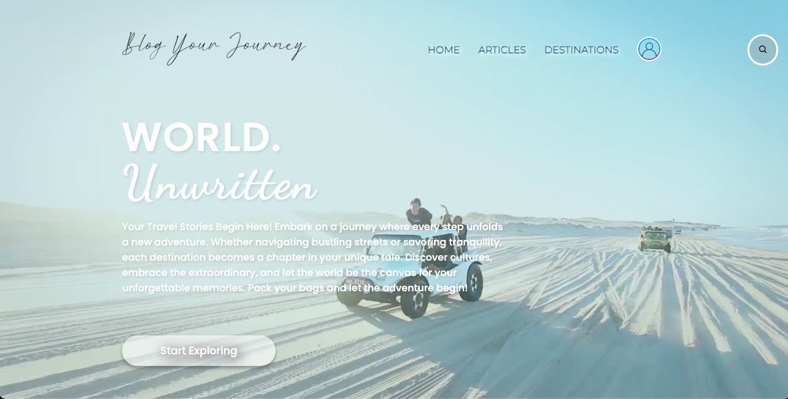

**Blog Your Journey** is a travel-themed blogging website designed to provide users with a platform to share their travel experiences. Users can register, log in, create and edit articles, comment, and like articles. This project is a full-stack application developed using the Svelte framework, HTML, CSS, JavaScript, Svelte, Express.js, Node.js, TinyMCE Editor and SQLite. 

**Team Name:** Coding **L-A-R-K**

**Team members:** **L**esley, **A**lan, **R**ita, **K**iko

**Blog Name:** Blog Your Journey

## Features

- User registration, login, and logout
- User profile editing and deletion
- Article creation, editing, and deletion
- Comment and like functionality
- Article categorization and browsing
- Search functionality (by author, title, and date)
- Responsive design for different devices

## Installation and Running Guide

### Prerequisites

- Node.js (recommended version 14.x or above)
- npm or yarn package manager

### Install Dependencies: 
Using npm: npm install
or using yarn: yarn install

### Running the Application
npm run dev

The application will run at http://localhost:5173/

## Usage
- Open your browser and navigate to http://localhost:5173/
- Register a new account or log in with an existing account.
- Browse the homepage and articles page to view articles posted by other users.
- Go to the "About me" page to edit your profile, create new articles, or manage existing articles.
- Comment on or like articles on the articles page.

**Recommendation:** Please use **CHROME** for better experience~

